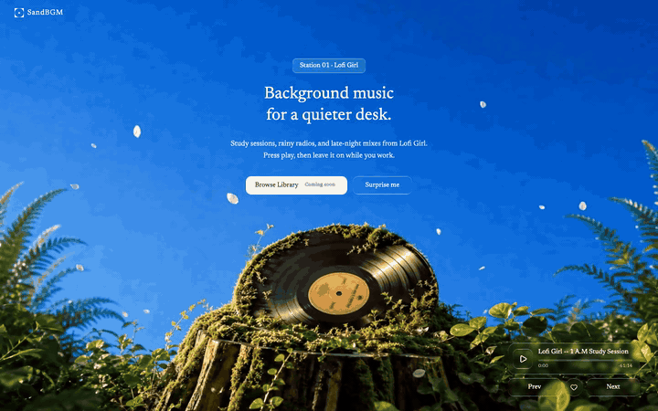

# SandBGM

Background music for a quieter desk.

**Live:** [https://pepedesigner.github.io/SandBGM/](https://pepedesigner.github.io/SandBGM/)

A one-page listening space built around CC-licensed Lo-fi tracks from [Free Music Archive](https://freemusicarchive.org/). Full-screen moss-and-vinyl loop, liquid-glass controls, press play and leave it on. **No ads.**

## Preview



## Features

- Full-screen boomerang video background
- CC-licensed Lo-fi Hip-Hop & Instrumental tracks — no ads, no interruptions
- Play, pause, previous / next, and a seekable progress bar
- **Surprise me** — jump to a random track
- **Browse Library** — pick any track from the catalog
- Newsreader serif type and liquid-glass buttons

## Stack

React · TypeScript · Vite · Tailwind CSS · HTML5 Audio

## Run locally

```bash
npm install
npm run dev
```

Open the local URL Vite prints. Browsers block unmuted autoplay, so the first sound needs a click on the player or **Surprise me**.

```bash
npm run build
npm run preview
```

## Music

Audio streams from [Free Music Archive](https://freemusicarchive.org/) under Creative Commons licenses (CC BY / CC BY-NC-ND). Artists include Ketsa, Pumpupthemind, and Joint C Beat Laboratory. Rights remain with the original artists — see each track page on FMA for full license details.
